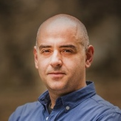

## Personal data
  
Name:  Vladislav Turiashvili  
Location: Georgia
## Projects 
Name: [EQUI](../projects/equi.md)  
Position: Co-founder  
## Contacts
[LinkedIn](https://www.linkedin.com/in/vladislavturiashvili/)  
[Telegram](https://t.me/vturias)  
[Twitter](https://twitter.com/vturias)
## About
More than 13 years in business ownership and management. Co-owner of several companies in entertainment industry including country’s leading professional A/V distribution and Integration Company. Over 10 years of technical project management experience in real estate development market. Extensive experience in small business process management and efficiency improvement.	Technical advisor for numerous projects. Supported and consulted different local small businesses in integrating modern technological tools for boosting business efficiency and reach significant cost savings.	Over 5 years in building efficient supply chains for different kinds of businesses.	Author of several government educational programs in field of TV/Entertainment industry.	Spreading awareness on blockhain technologies for business sector sicne 2016
