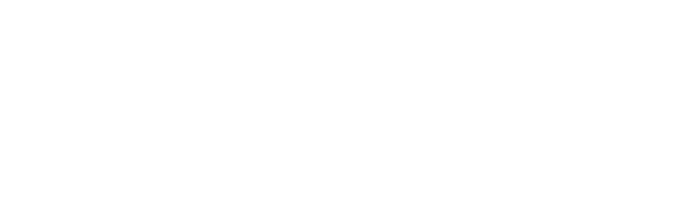

## Overview
  
Name: AirSwap
[Website](https://www.airswap.io/)   
Year founded:  2017  
ICO Start: October 10 2017  
End: October 11 2017  
Currency: token (AST)	  
## Staff 
Founder: [Michael Oved](../people/michael_oved.md)  
Founder: [Don Mosites](../people/don_mosites.md)  
Engineer: [Deepa Sathaye](../people/deepa_sathaye.md)  
Advisor: [Joseph Lubin](../people/joseph_lubin.md)  
Strategy: [Sam Tabar](../people/sam_tabar.md)  
PR & Marketing: [Nissa Szabo](../people/nissa_szabo.md)   
Advisor: [Brock Pierce](../people/brock_pierce.md)  
Advisor: [George Mueller](../people/george_mueller.md)  
Advisor: [Clifford Hart](../people/clifford_hart.md)    
Advisor: [Mark D'Agostino](../people/mark_d'agostino.md)  
Advisor: [Satoshi Kobayashi](../people/satoshi_kobayashi.md)
## Business Model
 As tokens take over the world, a new token economy needs decentralized exchange to thrive. AirSwap was designed from the ground up to provide privacy, security, and choice on a global, peer-to-peer trading network with no intermediaries and no trading fees. We at AirSwap truly aim to build the engine of the new token economy.
## Contacts  
[Bitcointalk](https://bitcointalk.org/index.php?topic=2208855.0;all)      
[Twitter](https://twitter.com/airswap)    
[Email](team@airswap.io)      
[Medium](https://medium.com/@airswap)  
[Facebook](https://www.facebook.com/airswapio)  
[Youtube](https://www.youtube.com/channel/UCb2tLdHXs72fdtKXGD1uPAg)  
## About 
[Whitepaper](https://swap.tech/whitepaper/)
## News
[AirSwap releases Roadmap](https://media.consensys.net/airswap-release-roadmap-6bc4d33f84cd)
