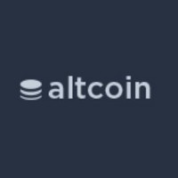

## Overview
  
Name: Altcoin Exchange   
[Website](https://www.altcoinexchange.com/)  
Year founded: 2017  
Currency: TBA  
## Staff
CEO: [Andrew Gazdecki](../people/andrew_gazdecki.md)  
[Nick Cote](../people/nick_cote.md)  
[Alan Ezeir](../people/alan_ezeir.md)  
[Josh Olszewicz](../people/josh_olszewicz.md)  
[Nate "Coinrun" Freire](../people/nate_freire.md)  
[CryptoBull](../people/cryptobull.md)  
[Michel Blend](../people/michel_blend.md)  
[Sulejman Sarajlija](../people/sulejman_sarajlija.md)  
[Djenad Razic](../people/djenad_razic.md)  
[Anto Brajkovicis](../people/anto_brajkovicis.md)  
## Business Model
Altcoin Exchange was founded to provide the world with the most trusted altcoin exchange platform in the world. Built By Traders, For Traders.
## Contacts
[Bitcointalk]()   
[Twitter](https://twitter.com/altcoinexchnge)    
[Blog](https://medium.com/@altcoinexchnge)    
[Telegram](https://t.me/altcoinexchange)  
## About
[Altcoin Exchange’s purpose, mission, values and value proposition](https://medium.com/@altcoinexchnge/altcoin-exchanges-purpose-mission-values-and-value-proposition-7d525303c005)  
[Altcoin Exchange Preview](http://preview.altcoinexchange.com/)  
[Altcoin Exchange User Suggestions](https://feedback.altcoinexchange.com/)
## News
