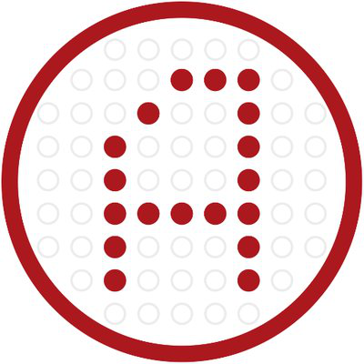

## Overview
  
Name:  ARNA Panacea  
[Website](https://token.arnagenomics.com/)   
Year founded:  2017   
ICO Start: 21 Sep 2017  
End: 3 Dec 2017  
Currency: token (ARNA)	 
## Staff 
Founder & CEO: [Egor Melnikov](../people/egor_melnikov.md)   
COO & Co-founder: [George Nikitin](../people/george_nikitin.md)  
Scientific supervisor and creator of the ARNA BC test: [Anatoliy Melnikov](../people/anatoliy_melnikov.md)   
PhD, Wageningen University, Netherlands: [Ilya Senechkin](../people/ilya_senechkin.md)  
Ph.D., molecular biotechnologist: [Sergey Chernyshev](../people/sergey_chernyshev.md)   
Software architect and developer: [Magomed Chatuev](../people/magomed_chatuev.md)  
Entrepreneur and co-owner: [Sergey Dolgachev](../people/sergey_dolgachev.md)   
## Business Model
ARNA Panacea is a solution which provides to all interested participants in the cancer diagnosis market with a new way of accessing and interacting with the system for collecting and storing medical research data. By using ARNA tokens, their holders will be able to access services and medical research data storage system for use in professional medical purposes, and to raise funds to begin new researches.
## Contacts  
[Bitcointalk](https://bitcointalk.org/index.php?topic=2181117)     
[Twitter](https://twitter.com/ArnaGenomics)   
[Telegram](https://t.me/arnagenomics)   
[Medium](https://medium.com/@arnagenomics)  
[Facebook](https://www.facebook.com/arnagenomics)  
  
## About 
[Whitepaper](https://token.arnagenomics.com/ARNA_whitepaper_en.html)