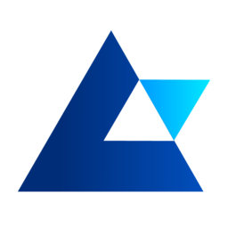

## Overview
  
Name: Auctus  
[Website](https://auctus.org/)   
Year founded: 2017 
ICO Start: 14 Nov 2017
End: 28 Nov 2017
Currency: token (AUC)	 
## Staff 
Lead developer: [Felipe Silveira](../people/felipe_silveira.md)  
Advisory and partnerships:  [Raphael Vantroost](../people/raphael_vantroost.md)  
Strategy:  [Vinicius Melo](../people/vinicius_melo.md)  
Lead ethereum engineer:  [Ariny Guedes](../people/ariny_guedes.md)  
Senior software engineer:  [Daniel Duarte](../people/daniel_duarte.md)  
Senior software engineer:  [Thiago Araújo](../people/thiago_araújo.md)  
Senior software engineer:  [Daniel Vitorino](../people/daniel_vitorino.md)  

## Business Model
The Auctus Project was created with the mission of improving the pension market by increasing transparency and eliminating common problems such as corporate governance issues, corruption, fraud, bribery, and bureaucracy, as well as lowering operational costs. Auctus is currently building a pension platform which will enable pension funds around the world to dramatically improve their operations and significantly cut operational costs. Through smart contract auditable code, the platform will ensure full transparency and compliance to fund rules and will furthermore allow calculations for contributions, employer match, benefits as well as other features, such as selection of investment profiles, registration of beneficiary designations (in case of death), administration fee calculations and portability between funds.

## Contacts  
[Bitcointalk]()     
[Linkedin](https://www.linkedin.com/company/24996477/)  
[Twitter](https://twitter.com/AuctusProject)      
[Slack](https://auctus-project.slack.com/join/shared_invite/MjM5NTU3NTI5OTA5LTE1MDUxNTkxMjgtZWI2MDY3MGMxNQ)  
[Medium](https://medium.com/auctus)
[Github](https://github.com/AuctusProject/)

  
## About 
[Whitepaper](https://dl.auctus.org/Auctus_Whitepaper.pdf)
