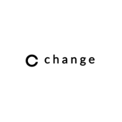

## Overview
  
Name: Change   
[Website](https://change-bank.com/)  
Year founded: 2016    
Currency: CAG    
## Staff
Founder, CEO: [Kristjan Kangro](../people/kristjan_kangro.md)  
Partner: [Artur Luhaäär](../people/artur_luhaaar.md)  
Partner: [Gustav Liblik](../people/gustav_liblik.md)  
Partner: [Karl Vään](../people/karl_vaan.md)  
CTO: [Edgars Simanovskis](../people/edgars_simanovskis.md)  
Developer: [Nakul Pant](../people/nakul_pant.md)  
Blockchain developer: [Henry Kehlmann](../people/henry_kehlmann.md)  
Blockchain expert: [Dragos Giugula](../people/dragos_giugula.md)  
Administrations/Finance: [Kenneth Loh](../people/kenneth_loh.md)  
Marketing expert: [Francisco Bernardo](../people/francisco_bernardo.md)  
## Business Model
Change is a crypto bank offering a wide range of financial services including a bank card, investment opportunities on a global marketplace, cryptocurrencies, insurance and more.
## Contacts
[Bitcointalk](https://bitcointalk.org/index.php?topic=2087937.0)   
[Facebook](https://www.facebook.com/changefinance/)   
[Twitter](https://twitter.com/changefinance)  
[LinkedIn](https://www.linkedin.com/company-beta/13190167/)     
[Blog](https://medium.com/@changebank)    
[Slack](https://coinchange.slack.com/join/shared_invite/MjIzMDgxNDQ0OTAwLTE1MDIwOTc5NTQtMWZlYzAxYTlkNA)  
[Telegram](https://t.me/joinchat/E7dDX0LwpOolBJ5z2MVSUw)  
## About
[Change Whitepaper](https://drive.google.com/file/d/0B4RKXcemFwwbNW5wVGtBMWM0c2s/view)  
[Interview with Change CEO](https://www.youtube.com/watch?v=tGCElDm3eEU&feature=youtu.be)  
## News
[Change token sale results](../news/change_18-10-17.md)  
[Change Bank - Announcing Pre-ICO Details](../news/change_03-09-17.md)  
[Indorse had announced the partnership with Change](../news/change_07-09-17.md)
