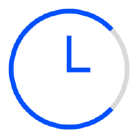

## Overview
  
Name: ChronoLogic    
[Website](https://chronologic.network/)  
Year founded: 2017   
Currency: DAY Token    
ICO Date: 28 August 2017  
## Staff
[Deven Soni](../people/deven_soni.md)  
[Eric Weiss](../people/eric_weiss.md)  
[Tosh Sharma](../people/tosh_sharma.md)  
[Jovar Gaylan](../people/jovar_gaylan.md)  
[Lee Pennington](../people/lee_pennington.md)  
## Business Model
ChronoLogic is the vision of time merging with the blockchain. It’s an introduction of the concept of Proof-of-Time
for blockchain technologies & practical applications.
The first phase of the ChronoLogic project is the DAY token introduction afterwhich the concept will be expanded to allow
practical implementation of Proof-of-Time by other projects & entities.
## Contacts
[GitHub](https://github.com/chronologic)  
[Bitcointalk](https://bitcointalk.org/index.php?topic=2051671.0)   
[Blog](https://blog.chronologic.network/)    
[Slack Ivinte](https://chronologic-slack.herokuapp.com/)  
## About
[ChronoLogic WhitePaper](https://chronologic.network/uploads/Chronologic_Whitepaper.pdf)
