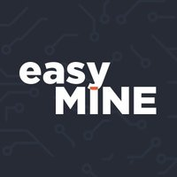

## Overview
  
Name: easyMINE    
[Website](https://easymine.io/#)  
Year founded: 2017    
Currency: EMT    
## Staff
Founder, CEO: [Lukasz Zeligowski](../people/lukasz_zeligowski.md)  
Founder, CFO: [Andrzej Belczak](../people/andrzej_belczak.md)  
Machine Learning Expert: [Andrzej Buller](../people/andrzej_buller.md)  
CTO: [Witold Turzanski](../people/witold_turzanski.md)  
Hardware Engineer: [Tomasz Widanka](../people/tomasz_widanka.md)  
Product Manager: [Dawid Gajek](../people/dawid_gajek.md)  
Smart Contract Developer: [Lukasz Gasior](../people/lukasz_gasior.md)  
## Business Model
easyMINE is a complete, self-contained software platform for cryptocurrency mining.
## Contacts
[Bitcointalk](https://bitcointalk.org/index.php?topic=2027065.0)   
[Facebook](https://www.facebook.com/Easymine.io/)   
[Twitter](https://twitter.com/easymineio)    
[Slack](https://slack.easymine.io/)  
## About
[WhitePaper](https://ico.easymine.io/easyMINE_Whitepaper.pdf)  
[ICO Page](https://ico.easymine.io/)  
