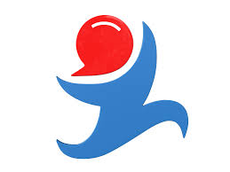

## Overview
  
Name: Golos  
[Website](https://golos.io/)   
Year founded: 2016  
Currency: token [(GOLOS)](https://coinmarketcap.com/currencies/golos/)	[GBG](https://coinmarketcap.com/currencies/golos-gold/)  
## Staff 
Co-Founder, Economics: [Dima Starodubtsev](../people/dima_starodubtsev.md)   
Co-Founder, Blockchain development:  [Valery Litvin](../people/valery_litvin.md)   
Co-Founder, Partnership:  [Marina Guryeva](../people/marina_guryeva.md)   
Co-Founder, Back-end:  [Alexey Frumin](../people/alexey_frumin.md)  
Co-Founder,Finance and audit: [Vitaly Lvov](../people/vitaly_lvov.md)  
Co-Founder, Business development: [Konstantin Lomashuk](../people/konstantin_lomashuk.md.md)  
Co-Founder, Consulting: [Valentine Zavgorodnev](../people/valentine_zavgorodnev.md)  
 
## Business Model
Golos is a dedicated Russian language social media and content platform that rewards users for generating well liked content. Golos is a licensed clone of the Steem.it blockchain designed to cater specifically to the needs of the Russian speaking community.  
Similar to Steem.it, Golos has three internal currencies: one for market trading [Voice, like Steem], one for voting on the platform [Voice Power, like Steem Power], and one with a stable value used to compensate users [Voice Gold, like Steem Dollars]. Voice Gold however is tied to the value of Gold, not the value of the US Dollar.
## Contacts   
[Twitter](https://twitter.com/@goloschain)   
[Telegram](https://t.me/golos_io)   
[Instagram](https://instagram.com/golos_io/)   
[Facebook](https://facebook.com/www.golos.io/)  
[Github](https://github.com/GolosChain)  
  
## About 
[Whitepaper](https://golos.io/ru--golos/@golos/golos-russkoyazychnaya-socialno-mediinaya-blokchein-platforma)
