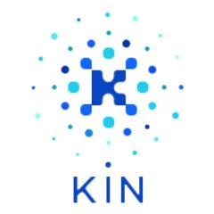

## Overview
  
Name: Kin   
[Website](https://kin.kik.com/)  
Year founded: 2017  
Currency: KIN  
ICO Start Date: 12 September 2017  
ICO End Date: 26 September 2017
## Staff
CEO: [Ted Livingston](../people/ted_livingston.md)  
CFO: [Peter Heinke](../people/peter_heinke.md)  
Chief Product Officer: [Eran Ben-Ari](../people/eran_ari.md)  
Senior Vice President of Engineering: [Dave Simons](../people/dave_simons.md)  
## Business Model
Kik Interactive Inc. is creating a Kin cryptocurrency as a first step to launching a decentralized ecosystem of digital services.
## Contacts
[Bitcointalk](https://bitcointalk.org/index.php?topic=1933262.0)     
[Twitter](https://twitter.com/@kin_foundation)    
[Blog](https://medium.com/kinfoundation)    
[Slack](http://slack.kinfoundation.com/)  
[Reddit](https://www.reddit.com/r/KinFoundation/)  
## About
[WhitePaper](https://kin.kik.com/papers/Kin_Whitepaper_V1_English.pdf?ver=3)
