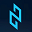

## Overview
  
Name: Neuromation  
[Website](https://neuromation.io/en/)  
Year founded: 2016  
Currency: NEUROTOKEN  
ICO: Start: 28. Nov 2017  
End: 	1. Jan 2018
## Staff
Founder & CEO: [Maxim Prasolov](../people/maxim_prasolov.md)  
Chariman & Investor: [Constantin Goltsev](../people/constantin_goltsev.md)  
CTO: [Fedor Savchenko](../people/fedor_savchenko.md)  
Chief Scientist: [Sergey Nikolenko](../people/sergey_nikolenko.md)    
Advisor: [Andrew Rabinovich](../people/andrew_rabinovich.md)  
Advisor: [David Orban](../people/david_orban.md)  
ICO Compliance Advisor: [Yuri Kundin](../people/yuri_kundin.md)
## Business Model
Distributed Synthetic Data Platform for Deep Learning Applications. The Neuromation Platform provides an exchange and an ecosystem where participants can either contribute or purchase the components of an AI model. The Platform will use distributed computing along with blockchain proof of work tokens to revolutionize AI model development. It will combine all the components necessary to build deep learning solutions with synthetic data in one place. Platform service providers, commercial or private, will provide specific resources for the execution and development of synthetic data sets, distributed computing services, and machine learning models, addressing the “three pillars” of AI.
## Contacts  
[Twitter](https://twitter.com/neuromation_io)  
[Linkedin](https://www.linkedin.com/company/neuromation-technologies/)  
[Facebook](https://www.facebook.com/neuromation/)      
[Blog](https://medium.com/neuromation-io-blog)  
[Telegram](https://t.me/Neuromation)  
[YouTube](https://www.youtube.com/channel/UC43ZGqyRIM30riSlQgmIlgQ)  
[Reddit](https://www.reddit.com/r/Neuromation/)  
## About  
[WhitePaper](https://neuromation.io/files/Neuromation_white_paper.pdf)  
