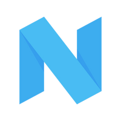

## Overview
  
Name: Nimfamoney    
[Website](https://nimfamoney.io/)  
Year founded: 2016  
Currency: NIMFA  
ICO Date: 29 August 2017  
## Staff
Founder: [Max Tarasenko](../people/max_tarasenko.md)  
Lead Blockchain-Developer: [Vlad Pezhemskiy](../people/vlad_pezhemskiy.md)  
Chief Technology Officer: [Dan Suvorov](../people/dan_suvorov.md)  
Chief Marketing Officer: [Alex Kharchevnikov](../people/alex_kharchevnikov.md)  
## Business Model
Nimfamoney is a cryptocurrency lending platform, that allows to borrow NIMFA tokens with a 0% interest rate (only for 30 days) and use them to participate in other ICOs. Every NIMFA token allows users to borrow 3 NIMFA tokens after depositing 3.3% of the amount of the loan (as the leverage and get borrowed tokens).  
Additional fee while paying the loan back: 10% of received profit at a closing of a position.
## Contacts
[GitHub](https://github.com/nimfamoney)  
[Bitcointalk](https://bitcointalk.org/index.php?topic=2040087.0)   
[Facebook](https://www.facebook.com/nimfamoney/)   
[Linkedin](https://www.linkedin.com/company-beta/12893942/)   
[Twitter](https://twitter.com/nimfamoney)    
[Slack](https://nimfa-team.slack.com/join/shared_invite/MjIyMTE5NDM3ODA4LTE1MDE5OTgzMzAtY2E5MWIzYjNiYQ)  
[Telegram](https://t.me/Nimfamoney)  
## About
[WhitePaper](https://nimfamoney.io/ENG_V.1.0_Whitepaper_ICO_Nimfamoney.pdf)
