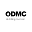

## Overview
  
Name: ODMCoin  
[Website](https://odmcoin.com/)  
Year founded: 2017  
Currency: ODMC  
ICO: Start: 2. Oct 2017  
End: 31. Oct 2017
## Staff
CEO: [Aleksandr Doronin](../people/aleksandr_doronin.md)  
Chief of Science: [Oleg Novikov](../people/oleg_novikov.md)  
IT Chief: [Fanil Yusupov](../people/fanil_yusupov.md)  
Press Center Director: [Irina Barzhak](../people/irina_barzhak.md)
## Business Model
The project to implement the world's first investment financial blockchain product in the oil and gas sector - the derivative ODMCoin combines advanced technologies in the field of finance and industrial production of equipment for processing oil drilling mud. Oil Drilling Mud is a liquid, paste-like or solid waste that is a mixture of oil (oil products), a solid phase (soil and ground particles) and water.
## Contacts  
[Twitter](https://twitter.com/ODMCoin)    
[Facebook](https://www.facebook.com/groups/122913815006962)      
[Telegram](https://t.me/odmcoin_talk)  
[Youtube](https://www.youtube.com/channel/UCFCyaomld9O3fV3pw7Mcwaw)
## About  
[WhitePaper](https://odmcoin.com/assets/files/docs/en/White_paper.pdf)  
