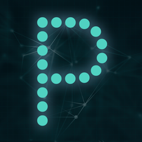

## Overview
  
Name: Proof  
[Website](https://www.proofsuite.com/)  
Year founded: 2016   
Currency: Proof Token  
ICO Start Date: 08 October 2017
## Staff
Co-Founder, CEO: [Mike De’Shazer](../people/mike_deshazer.md)  
Co-Founder, CTO: [Tai Kersten](../people/tai_kersten.md)  
Co-Founder, CIO: [David Van Isacker](../people/david_isacker.md)  
## Business Model
Proof was created to transform low-risk investments (like valuable real estate, highly credible businesses, and interest-yielding business loans) into ownership tokens for anyone to buy.
Listed investment opportunities are vetted by our partners, officiated with legal agreements stored on the blockchain, and administered by immutable smart contracts, eliminating middlemen and facilitating pure peer-to-peer trades. 
## Contacts
[GitHub](https://github.com/proofsuite)  
[Bitcointalk](https://bitcointalk.org/index.php?topic=2124201.0)   
[Facebook](https://www.facebook.com/proofsuite/)   
[Linkedin](https://www.linkedin.com/company-beta/13257690/)   
[Twitter](https://twitter.com/proofsuite)   
[Blog](https://medium.com/proof-of-fintech)    
[Slack](http://slack.proofsuite.com/)  
## About
[WhitePaper](https://www.proofsuite.com/media/whitepaper.pdf)
