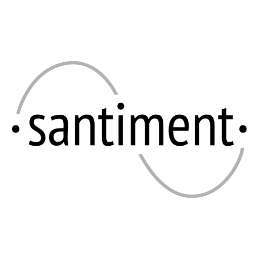

## Overview
  
Name: Santiment  
[Website](http://www.santiment.net/)   
Year founded: 2017  
Currency: token [(SAN)](https://coinmarketcap.com/assets/santiment/)	 
## Staff 
Founder: [Maksim Balashevich](../people/maksim_balashevich.md)   
Ethereum Scientist:  [Dmitry Palchun](../people/dmitry_palchun.md)  
Full-stack Developer:  [Eugene Tartakovsky](../people/eugene_tartakovsky.md)     
Mathemagician, PhD:  [Tzanko Matev ](../people/tzanko_matev.md)  
Marketing/PR Wizard: [Mitchell Loureiro](../people/mitchell_loureiro.md)  
Mobile Developer: [Igor Matyushkin](../people/igor_matyushkin.md)  
UI/UX Designer: [Kim Carson](../people/kim_carson.md)  
Designer & Illustrator: [Feng Jiahong](../people/feng_jiahong.md)  
Community Manager: [Kelvin “Wilhelm” Lee](../people/kelvin_wilhelm_lee.md)  
## Business Model
 Santiment is the datafeeds platform for the crypto-markets. By providing a library of machine-to-machine datafeeds, expert-curated content, and a transparent database of projects and due diligence records, Santiment aims to be the financial data infrastructure of a crypto and blockchain economy.
## Contacts  
[Bitcointalk](https://bitcointalk.org/index.php?topic=1783230.0)     
[Github](https://github.com/santiment)  
[Twitter](https://twitter.com/santimentfeed)   
[Telegram](https://t.me/santiment_network)   
[Slack](https://santiment-slack.herokuapp.com/)  
[Medium](https://medium.com/santiment) 

  
## About 
[Whitepaper](https://docs.google.com/document/d/1hHmJQWrPrObSgCA8kTbk-4LgqGbYzukQAjtg5b8jwc0/edit)
