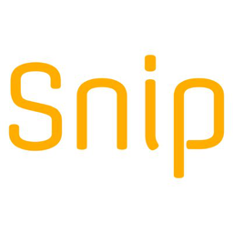

## Overview
  
Name: Snip  
[Website](https://www.snip.network/)   
Year founded: 2017  
ICO Start: 29 Sep 2017  
End: 28 Oct 2017  
Currency: token (SNP)	 
## Staff 
CEO: [Ran Reichman](../people/ran_reichman.md)  
CTO: [Rani Horev](../people/rani_horev.md)  
Marketing: [Ofir Avigad](../people/ofir_avigad.md)  
Advisor: [Richard Titus](../people/richard_titus.md)  
Advisor: [Lou Kerner](../people/lou_kerner.md)  
## Business Model
 Snip is a summarized (short) news platform, decentralized and powered by the community. On Snip, anyone can write a short news story about any topic, and readers can find news that matters to them. Contributors are rewarded according to reader feedback. Writers get rewards for viewership etc. Advertisers use it to buy ad space. Users pay for premium services like audio snips
## Contacts  
[Bitcointalk](https://bitcointalk.org/index.php?topic=2074134.0)     
[Facebook](https://www.facebook.com/sniptoday)  
[Twitter](https://www.facebook.com/sniptoday)   
[Telegram](https://t.me/Sniptoday)   
[Slack](https://www.snip.network/slack/)  
[Medium](https://medium.com/snip-news)  
[Github](https://github.com/SnipToday)
  
## About 
[Whitepaper](https://media.snip.today/Snip_Whitepaper_en.pdf)
## News

## Similar projects
[Steem](steem.md)
