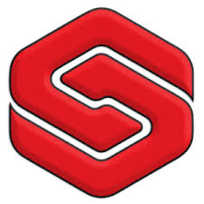

## Overview
  
Name: Soferox  
[Website](http://www.soferox.com/)  
Year founded: 2017    
Currency: SFX   
## Staff
Co-Founder, CEO: [Aaron Mathis](../people/aaron_mathis.md)  
Co-Founder, CTO: [Alex Williams](../people/alex_williams.md)  
Head of Marketing: [Chris Bennett](../people/chris_bennett.md) 
## Business Model
Soferox allows users to send, receive and store cryptocurrencies for free. They will be offering individuals and companies the ability to create invoices, send and 
receive payments, exchange and swap currencies, and act as a safe and secure vault, all while charging no fees.
## Contacts
[Bitcointalk](https://bitcointalk.org/index.php?topic=2044176.0)   
[Facebook](https://www.facebook.com/soferoxllc)   
[Twitter](https://twitter.com/SoferoxLLC)  
[Linkedin]()     
[Blog](http://www.soferox.com/soferox-blog/)    
[Reddit](https://www.reddit.com/r/Soferox/)  
## About
[WhitePaper](http://www.soferox.com/wp-content/uploads/2017/08/Soferox-White-Paper-V3.pdf)  
