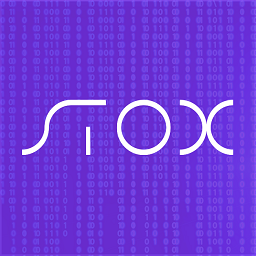

## Overview
  
Name:  Stox 
[Website](https://www.stox.com/)   
Year founded:  2017  
ICO Start: 2. Aug 2017  
End: 16. Aug 2017  
Currency: token (STX)	 
## Staff 
Founder [Ophir Gertner](../people/ophir_gertner.md) 
Executive Director: [Marek Lorinc](marek_lorinc.md)
COO [Yossi Peretz](../people/yossi_peretz.md) 
CTO [Amit Maor](../people/amit_maor.md) 
CMO [Niv Abramovich](../people/niv_abramovich.md) 
Legal Counsel [Steven Kruger](../people/steven_kruger.md) 
Blockchain Architect [Oded Noam](../people/oded_noam.md) 
Blockchain Security Architect [Leonid Beder](../people/leonid_beder.md) 
Head of UX & Design [Shay Cohen](../people/shay_cohen.md) 
Head Of Product & QA [Eran Klein](../people/eran_klein.md) 
Core developer [Danny Hellman](../people/danny_hellman.md) 
## Business Model
Stox is an open source, Bancor based prediction market platform.
Using the wisdom of the crowd, every day people will be able to predict and trade the outcome of events in almost any imaginable category: Finance, sports, politics and even the weather.
Stox is designed to accommodate and be intuitive for mainstream audiences.
Powering Stox will be the STX digital token, the primary form for fees, collaterals, and the currency for investment in event outcomes.
Stox will feature invest.com as its debut provider and operator.
Stox incentivizes other industry leaders with existing customer bases, like invest.com, to join the Stox network and drive traffic to the network.
## Contacts    
[Twitter](https://twitter.com/stx_coin)   
[Telegram](https://t.me/joinchat/DByWw0Pnq9BAy4FqPv_Lyg)   
[Reddit](https://www.reddit.com/r/STOX/)  
[Github](https://github.com/stx-technologies/stox-token)
  
## About 
[Whitepaper](https://www.stox.com/assets/pdf/stox-whitepaper.pdf)
