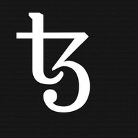

## Overview
  
Name: Tezos    
[Website](https://www.tezos.com/)  
Year founded: 2014    
Currency: XTZ 
## Staff
[Arthur Breitman](../people/arthur_breitman.md)  
[Kathleen Breitman](../people/kathleen_breitman.md)  
[Vincent Bernardoff](../people/vincent_bernardoff.md)  
[Bozman Cagdas](../people/bozman_cagdas.md)  
[Benjamin Canou](../people/benjamin_canou.md)  
[Pierre Chambart](../people/pierre_chambart.md)  
[Gregoire Henry](../people/gregoire_henry.md)  
[Mohamed Iguernlala](../people/mohamed_iguernlala.md)  
[Fabrice Le Fessant](../people/fabrice_fessant.md)  
[Guillem Rieu](../people/guillem_rieu.md)  
[Alain Mebsout](../people/alain_mebsout.md)  
## Business Model
Tezos is a self-amending cryptographic ledger. It achieves consensus not just about the state of a ledger, but about the state of its own protocol.
## Contacts
[GitHub](https://github.com/tezos/tezos)  
[Bitcointalk](https://bitcointalk.org/index.php?topic=715818.200)   
[Twitter](https://twitter.com/tez0s)     
[Forum](https://forums.tezos.community/)  
[Blog](https://medium.com/tezos)    
[Reddit](https://www.reddit.com/r/tezos/)  
[Slack](https://www.tezos.com/slack.html)  
[Telegram Discussion Channel](t.me/tezosico)  
[Telegram FAQ Channel](t.me/tezosfaq)  
## About
[A beginner’s guide to Tezos](https://medium.com/@linda.xie/a-beginners-guide-to-tezos-c9618240183f)  
[Tezos Presantation](https://www.tezos.com/static/papers/Tezos_Overview.pdf)  
[Tezos Position Paper](https://www.tezos.com/static/papers/position_paper.pdf)  
[Tezos Technical WhitePaper](https://www.tezos.com/static/papers/white_paper.pdf)  
[Tezos Philosophy and Values](https://medium.com/tezos/tezos-philosophy-and-values-9297f308ae21)
