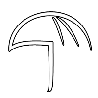

## Overview
  
Name: Umbrella Coin (UMC)     
[Website](https://www.umbrellacoin.org)  
Year founded: 2017       
Currency: UMC Token  
ICO Date: 20 August 2017  
## Staff
Founder, CEO: [Terry Tata](../people/terry_tata.md)  
Lead Blockchain Developer: [Roshan Parikh](../people/roshan_parikh.md)  
Software Architect: [David Lackey](../people/david_lackey.md)  
Senior Software Engineer: [Elizabeth Sternhell](../people/elizabeth_sternhell.md)  
Backend Software Engineer: [Christopher Fong](../people/christopher_fong.md)  
Chief of Marketing and Sales: [Son Nguyen](../people/son_nguyen.md)  
Marketing and Sales: [David Arnold](../people/david_arnold.md)  
Marketing and Sales: [Alexander Vargas](../people/alexander_vargas.md)  
## Business Model
Umbrella Coin (UMC) is a Decentralized Incurance Platform.
The idea from Umbrella Coin is that if the middle men are no longer present, fees should drop and claim decisions will be made for the correct reasons.
Making UMC holders both the insurers and policyholders results in situation when those who are insured will vote on other’s claims, essentially deciding if payment should be made.
## Contacts
[GitHub](https://github.com/umbrellacoin)  
[Bitcointalk](https://bitcointalk.org/index.php?topic=2025943.0)   
[Facebook](https://www.facebook.com/umbrellacoin/?ref=page_internal)   
[LinkedIn]()   
[Blog](https://medium.com/@umbrellacoin)    
[Discord](https://discordapp.com/invite/mwKSgTK)  
[Telegram](https://t.me/joinchat/GlFQWQnEUAQcPiz3dg2iHQ)  
[Reddit](https://www.reddit.com/r/UmbrellaCoin/)  
## About
[Umbrella Coin WhitePaper](https://github.com/umbrellacoin/umc/blob/master/documents/UMC.pdf)
