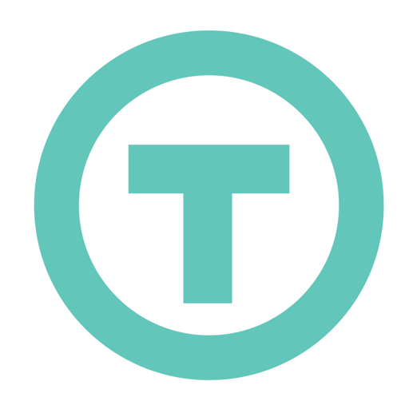

## Overview
  
Name: WeTrust
[Website](https://www.wetrust.io/)   
Year founded: 2017
Currency: token (TRST)	 
## Staff 
Co-Founder: [George Li](../people/george_li.md)
Co-Founder & Strategy Operations: [Patrick Long](../people/patrick_long.md)
Co-Founder & CTO: [Ron Merom](../people/ron_merom.md)
Principal Engineer: [An Zheng](../people/an_zheng.md)
FrontEnd Developer: [Tom Nash](../people/tom_nash.md)
Smart Contract Developer: [Shine Lee](../people/shine_lee.md)
Research and Global Partnerships Manager: [Mivsam Yekutiel](../people/mivsam_yekutiel.md)  
## Business Model
WeTrust is a collaborative saving and insurance platform. It is autonomous, frictionless, and decentralized. WeTrust utilizes the Ethereum blockchain to create a full-stack financial system that leverages existing social capital and trust networks, eliminating the need of a “trusted third party”, which allows for lower fees, improved incentive structures, decentralized risks, and a greater amount of capital to reside among the participants.
## Contacts  
[Bitcointalk](https://bitcointalk.org/index.php?topic=1773367)     
[Github](https://github.com/WeTrustPlatform)  
[Twitter](https://twitter.com/wetrustplatform)      
[Slack](https://www.wetrust.io/#home-section-slack)  
[Medium](https://medium.com/wetrust-blog)
[Facebook](https://www.facebook.com/wetrustplatform)
[Reddit](https://www.reddit.com/r/WeTrustPlatform)
## About 
[Whitepaper](https://github.com/WeTrustPlatform/documents/blob/master/WeTrustWhitePaper.pdf)