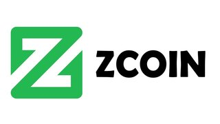

## Overview
  
Name: Zcoin    
[Website](https://zcoin.io/)  
Year founded: 2015  
Currency: [XZC](https://coinmarketcap.com/currencies/zcoin/)  
## Staff
Founder and Core Developer: [Poramin Insom](../people/poramin_insom.md)  
Developer: [Aizensou](../people/aizensou.md)  
Developer: [snguyen](../people/snguyen.md)  
Miner Developer: [djm34](../people/djm34.md)  
Developer: [Saran Siriphantnon](../people/saran_siriphantnon.md)  
Solidity Developer: [Tadhg Riordan](../people/tadhg_riordan.md)  
## Business Model
Zcoin is a decentralized and open source currency that provides financial privacy enabled by the Zerocoin protocol
## Contacts
[GitHub](https://github.com/zcoinofficial/zcoin)  
[Bitcointalk](https://bitcointalk.org/index.php?topic=1638450)   
[Facebook](https://www.facebook.com/zcoinofficial)   
[Twitter](https://twitter.com/zcoinofficial?lang=en)    
[Blog](https://zcoin.io/blog/)    
[Slack](http://invite.zcoin.io/)  
[Reddit](https://www.reddit.com/r/zcoin/)  
[Telegram](https://telegram.me/zcoinproject)   
## About
[Zcoin RoadMap](https://zcoin.io/zcoin-roadmap/)  
## News
[Zcoin Dev Update - September](../news/zcoin_19-09-17.md)  
[Zcoin’s privacy technology compared to competitors](../news/zcoin_12-09-17.md)  
